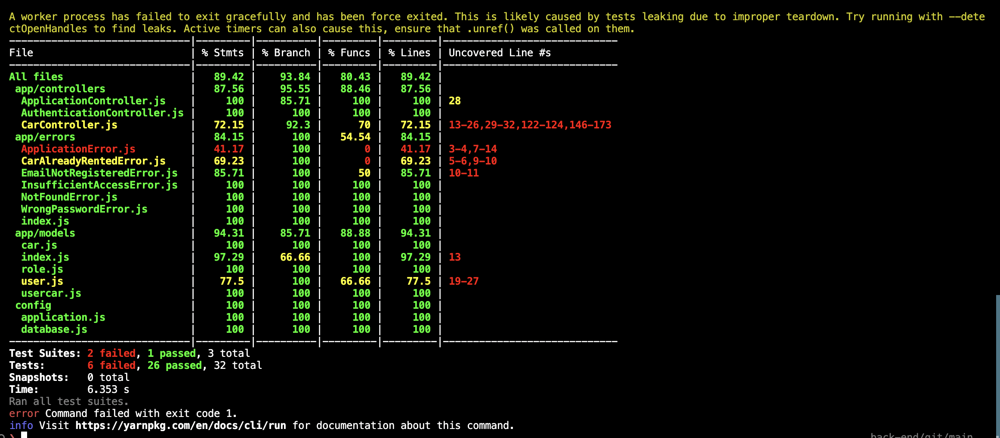

# LINK URL DEPLOYMENT WITH RAILWAY
https://binar-fsw-challenge-08-production.up.railway.app/

# TEST RESULT


# Getting Started
1. Clone repository
2. Install dependencies using yarn or npm

```
yarn install
```

3. Start project
```
yarn start

# BCR API

Di dalam repository ini terdapat implementasi API dari Binar Car Rental.
Tugas kalian disini adalah:
1. Fork repository
2. Tulis unit test di dalam repository ini menggunakan `jest`.
3. Coverage minimal 70%

Good luck!
